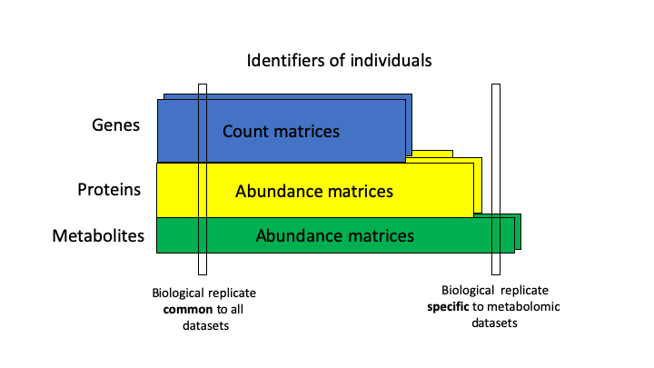

# RFLOMICS : R package and Shiny interface for Integrative analysis of omics data

# Introduction

  The acquisition of **multi-omics data** in the context of **complex experimental design** is a widely used practice to 
identify genes, proteins, metabolites and decipher the biological processes they are involved. The investigation of each omics layer 
is a good first step to explore and extract relevant biological variability. The statistical integration could then
be restrained to pertinent omics levels and features. Such analysis of heterogeneous data remains a technical 
challenge with the needs of expert methods and parameters to take into account data specificity.
Furthermore, applying different statistical methods from several tools is also a technical challenge in term of data management. 
n this context, we developed RFLOMICS:  **R package coupled with a shiny application** dedicated to the management and analysis of multiple omics-datasets in the statistical framework of **vertical integration** of observations (i.e. analysis of omics data across experiments on the same individuals) see the figure below.

 

RFLOMICS currently supports up to three types of omics: RNAseq, proteomics, and metabolomics. and 

# Aims
- Guarantee the relevance of the used methods and parameters (RNAseq workflow: [DicoExpress](https://plantmethods.biomedcentral.com/articles/10.1186/s13007-020-00611-7), [CATI Sysmics](https://sysmics.cati.inrae.fr/))
- Ensure the reproducibility of analysis

#  Features

- It can deal with **multi-factorial experiments** (up to 3 biological factors).
- It manages raw and processed (filtred, normalized) datasets **(MultiAssayExperiment package)**
- It can allows the remote computing for time/cpu consuming tasks **(clustermq package)**

     
# Input
- RNAseq (illumina data sequencing technology): matrix of gene expression based on raw reads count quantification.

  -> gene_id in line and individuals in column

- Proteomic (LC-MS/MS mass spectrometry): matrix of protein abundances based on XIC quantification (Extracted ion chromatograms)

  -> protein_id in line and individuals in column

  -> preprocessed matrix are expected for the moment (NA imputation, filtering)

- Metabolomic (GC-MS mass spectrometry): matrix of metabolomic abundances based on XIC quantification Extracted ion chromatograms

  -> metabolite_id in line and individuals in column

  -> preprocessed matrix are expected for the moment (NA imputation, filtering)

# Datasets example
- ecoseed dataset: Data have been provided by Loic Rajjou and Gwendal Cueff. They are included in the inst/ExampleFiles/ecoseed directory of the package. Briefly, A. thaliana's transcriptoms, proteoms and metaboloms have been obtained in the context of the study of seed germination and vigor. In particular, the author were interested in the influence of temperature (high, medium and low) and imbibition (Dry: DI, early imbibition: EI and late imbibition: LI) on gene's expression.
- [An example of report](RFLOMICSapp/www/ecoseed-report.html)

# [Vignettes](docs/index.html)

# Contact and support
[ijpb-bioinfo-team](mailto:ijpb-bioinfo-team@inrae.fr)

# References
- [CATI Sysmics](https://sysmics.cati.inrae.fr/),
- [Ilana L. et al. (2020), DiCoExpress](http://eutils.ncbi.nlm.nih.gov/entrez/eutils/elink.fcgi?dbfrom=pubmed&id=32426025&retmode=ref&cmd=prlinks)
- [MultiAssayExperiment package](https://bioconductor.org/packages/release/bioc/html/MultiAssayExperiment.html)
- [edgeR package](https://bioconductor.org/packages/release/bioc/html/edgeR.html)
- [limma package](https://bioconductor.org/packages/release/bioc/html/limma.html)
- [coseq package](https://bioconductor.org/packages/release/bioc/html/coseq.html)
- [clustermq package](https://cran.r-project.org/web/packages/clustermq/index.html)
  

