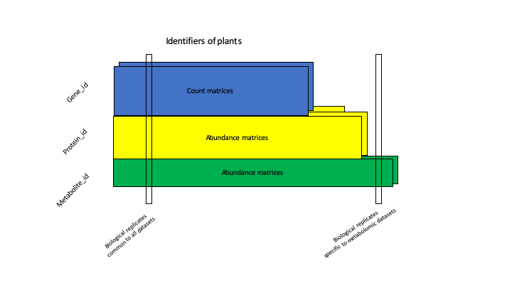
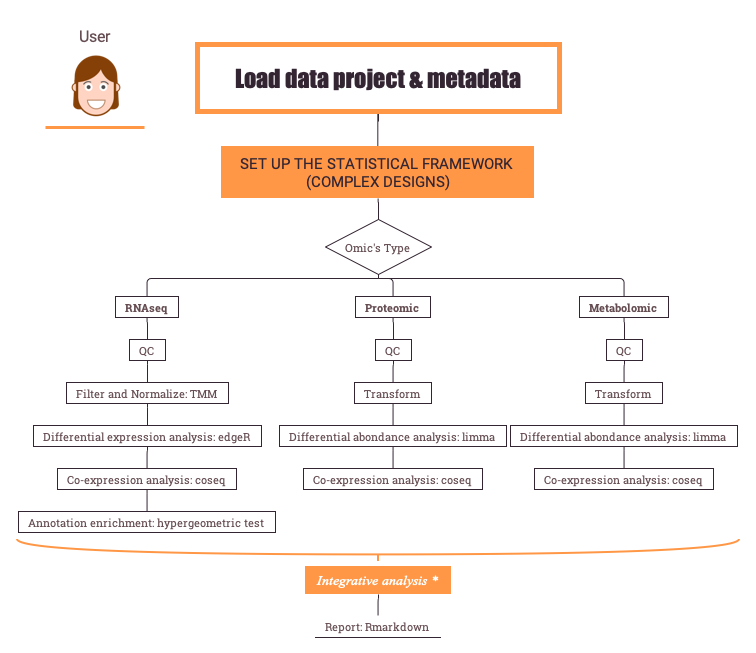

# RFLOMICS : Interactive web application for Omics-data analysis

# Introduction
**Rflomics is a** ( under devlopement ) **R package coupled with a shiny application** dedicated to the managment and analysis of multiple omics-datasets (RNAseq illumina, proteomic LC-MS/MS, … ) in the statistical framework of **vertical integration** of observations (i.e. analysis of omics data across experiments on the same indivuals) see the figure below.

For the moment, Rflomics can deal with **multi-factorial experiments** (up to 3 biological factors with a batch factor) and helps to set up the statistical model and contrasts associated to the biological experiments. RNA, proteomic and metabolomic datasets are then analysed with expert methods and parameters.

# Aims
- Guarantee the relevance of the used methods and parameters (RNAseq workflow: [DicoExpress](https://plantmethods.biomedcentral.com/articles/10.1186/s13007-020-00611-7))
- Decrease the time spend to code robust analysis
- Allow experiment sharing and capitalizing
- Ensure the reproducibility of omics analysis

#  Features

- It manages raw and processed (filtred, normalized) datasets **(MultiAssayExperiment package)**
- It can allows the remote computing for time/cpu consuming tasks **(clustermq packag)**

h4("Incoming Features")
- start to include multi-omics integration methods (MCIA first ?)
- Imputation of missing values for proteomics and metabolomics data
                    
# Input
- RNAseq (illumina data sequencing technology): matrix of gene expression based on raw read count quantification.
  -> gene_id in line and individuals in column
- Proteomic (LC-MS/MS mass spectrometry): matrix of protein abundances based on ",tags$b("XIC quantification"), "(Extracted ion chromatograms)   -> protein_id in line and individuals in column
  -> preprocessed matrix are expected for the moment (NA imputation, filtering)
- Metabolomic (GC-MS mass spectrometry): matrix of metabolomic abundances based on XIC quantification Extracted ion chromatograms
  -> metabolite_id in line and individuals in column
  -> preprocessed matrix are expected for the moment (NA imputation, filtering)

# Datasets example
- ecoseed dataset: Data have been provided by Loic Rajjou and Gwendal Cueff. They are included in the inst/ExampleFiles/ecoseed directory of the package. Briefly, A. thaliana's transcriptoms, proteoms and metaboloms have been obtained in the context of the study of seed germination and vigor. In particular, the author were interested in the influence of temperature (high, medium and low) and imbibition (Dry: DI, early imbibition: EI and late imbibition: LI) on gene's expression.
- [An example of report](RFLOMICSapp/www/ecoseed-report.html)

# [Vignettes](https://forgemia.inra.fr/flomics/rflomics/-/blob/develop.0.1/docs/index.htmp)

# Contact and support
ijpb-bioinfo-team

# References
- Paysant-Le Roux C. (2020), packageContrast_2020, unpublished"),
- [Ilana L. et al. (2020), DiCoExpress](http://eutils.ncbi.nlm.nih.gov/entrez/eutils/elink.fcgi?dbfrom=pubmed&id=32426025&retmode=ref&cmd=prlinks)
- [MultiAssayExperiment package](https://bioconductor.org/packages/release/bioc/html/MultiAssayExperiment.html)
- [edgeR package](https://bioconductor.org/packages/release/bioc/html/edgeR.html)
- [limma package](https://bioconductor.org/packages/release/bioc/html/limma.html)
- [coseq package](https://bioconductor.org/packages/release/bioc/html/coseq.html)
- [clustermq package](https://cran.r-project.org/web/packages/clustermq/index.html)
  

