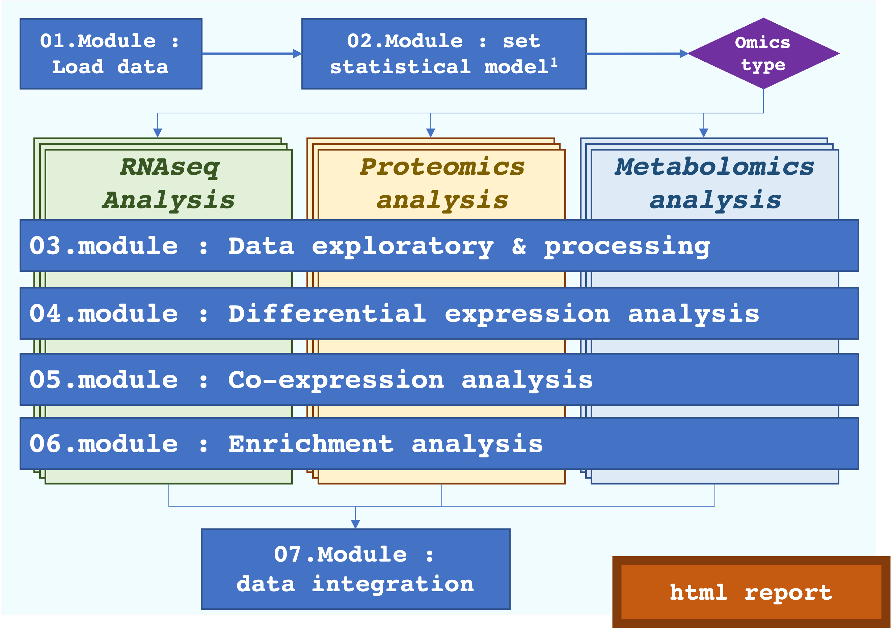

# RFLOMICS : R package and Shiny interface for Integrative analysis of omics data

The acquisition of **multi-omics data** in the context of **complex experimental design** is a widely used practice to identify features (transcripts, proteins, metabolites,...) and decipher the biological processes they are involved in. The investigation of each omics layer is a good first step to explore and extract relevant biological variability. The statistical integration could then be restrained to pertinent omics levels and features. Such analysis of heterogeneous data remains a technical challenge with the needs of expertise methods and parameters to take into account data specificity. Furthermore, applying different statistical methods from several tools is also a technical challenge in term of data management. In this context, we developed RFLOMICS.

**RFLOMICS** is an R package and Shiny interface that offers guided, comprehensive, and reproducible analysis within a framework designed to manage multiple omics datasets. The interface provides remarkable flexibility, enabling users to seamlessly navigate between result exploration and visualization.



**Specifications:**
- Performs complete multi-omics project analysis,
- Support multi-factorial experimental design (up to 3 biological factors), 
- Guarantees the relevance of the used methods,
- Reduces the analysis time on the unavoidable steps,
- Ensure the reproducibility of omics analysis,
- Accessible via one and simple user-friendly interface

**Constraints:**
- 3 types of omics data : RNAseq (read count), metabolomics (abundance) and proteomics (abundance)
- less than 10 datasets per omics type.
- 1 - 3 biological factors
- 1 - 2 batch factors and at least 3 replicates
- Complete (mandatory) and balanced (recommended) design 


## Use Rflomics

### From SK8 platform
https://rflomics.sk8.inrae.fr/

### Locally 

**Install**

Download from <https://forgemia.inra.fr/flomics/rflomics/-/archive/master/rflomics-master.tar.gz>

``` r
#setwd("workdir")
install.packages("rflomics-master.tar.gz", repos = NULL, type = "source")
```

Or

Clone from forgemia repository
```  
git clone https://forgemia.inra.fr/flomics/rflomics.git
```

``` r
setwd("rflomics/")

#library(remotes)
remotes::install_local(upgrade="never")
```

**Prerequisites for using MOFA2 (MAC OS & Windows)**

Install Python:
https://www.python.org/downloads/

Install mofapy2:
```
pip install mofapy2
```

Setting the value of the RETICULATE_PYTHON environment variable to a Python binary:
```
cd
echo "Sys.setenv(RETICULATE_PYTHON = \"path_to_python_bin\")" >> .Rprofile
```

**Run rflomics**

``` r
library(RFLOMICS)

RFLOMICS::runRFLOMICS()
```

### [Vignettes](https://flomics.pages.mia.inra.fr/rflomics/index.html)

## Licence
Artistic-2.0


## Contact and support
[ijpb-bioinfo-team](mailto:ijpb-bioinfo-team@inrae.fr) (ijpb-bioinfo-team@inrae.fr)

## References
-   [CATI Sysmics](https://sysmics.cati.inrae.fr/),
-   [Ilana L. et al. (2020)](http://eutils.ncbi.nlm.nih.gov/entrez/eutils/elink.fcgi?dbfrom=pubmed&id=32426025&retmode=ref&cmd=prlinks)
-   [Efstathiou G, et al. 2017]()
