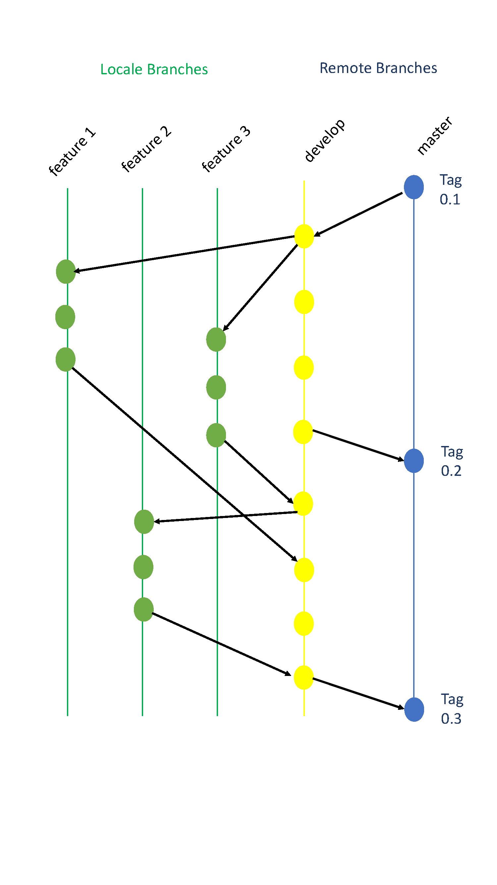

# Installation of the development environment:


## R, Rstudio, latex and git 

1. Install or update R
2. Install or update Rstudio
3. Install packages (tidyr, dplyr, stringr, magrittR, tibble, FactoMineR, RColorBrewer, shiny, shinydashboard, ggplot2, rmarkdown)
```{rinstall1, eval=FALSE}
#install.packages("tidyr", "dplyr", "stringr", "magrittR", "tibble", "FactoMineR", "RColorBrewer", "shiny", "shinydashboard", "ggplot2", "rmarkdown")
install.packages(c("FactoMineR", "shiny", "clustermq", "shinydashboard"))

```

4. Install Bioconductor and install S4Vectors and SummarizedExperiment packages
```{r install2, eval=FALSE}
if (!requireNamespace("BiocManager"))
    install.packages("BiocManager")
BiocManager::install()

BiocManager::install(c("edgeR","S4Vectors", "MultiAssayExperiment"))
```
5. Install or update latex (ex : http://www.tug.org/mactex)
6. Install or update git (https://git-scm.com/downloads)


### Git configuration

5. Git configuration
  +	Open the RStudio Preferences
  +	Go to Git/SVN
  + Change the path to the Git executable and Create a RSA Key (to synchronize your 
  repository without password)

6. Install the Tools package

7. Install or update Bioconductor

### Configure your SSH connection from the web interface of the MIA forge (https://forgemia.inra.fr/flomics/rflomics)

8.	Add the ssh key obtained during the git configuration via Rstudio (point 5)

  +	Click on your Profile after having clicked on your avatar (in the top rigth)
  +	Click on the pen behind the avatar
  +	Click on the SSH keys in the menu on the left
  + Copy and paste the content of the file obtained in 5 (~/.ssh/id_rsa.pub)

### Clone and install the RFLOMICS project from Rstudio 

9.	Clone the RFLOMICS project:
  +	Execute the New Project command (from the Project menu)
  +	Choose to create a new project from Version Control
  + Choose Git or Subversion as appropriate
  + Provide the repository URL (git@forgemia.inra.fr:flomics/rflomics.git) 
  and the name of the directory (rflomics) then click Create Project 

The remote repository will be cloned into the specified directory and RStudio's version control 
features will then be available for that directory.

10.	Build and Installation of the package RFLOMICS
  +	Cliquer sur build dans le menu de la fenêtre en haut à droite
  +	Cliquer sur Install and Restart

# Development: Best Practices with git     

## Presentation of the Rstudio interface to your local repository

From the window on your top left, a git tab is available. When you click on it,
8 new tab appears:
  + Diff:
  + Commit:
  + Pull (arrow):
  + Push (arrow):
  + 'clock' icon:
  + 'cogwheel/rouage' icon:
  + 'diagram icon':
  +  master with an arrow:

You will also have a list with all the files.

  + ? => file known but untracked
  + A => file added
  + M => file modified
  + D => file deleted
  + U => file with conflict
  
It is possible to use git via the Rstudio interface, with the folowing command:

  +	Git add : Click to the radio buttom near the file (on the left)
  +	Git commit : Commit buttom, then register the message with the commit, the submit
  + Git push: Push (arrow) in green to synchronize your repository with the mia forge, sending
  your devlopment.

But we recommanded to open a shell and write the command line. It will prevent, by example,
to push branche by error.
The next session will present a development model with the associated command lines. 
  
## Development model (Workflow):



2 main branches which will be synchronized with the remote repository:
- The master branche (Tagged version of the package)
- The 'develop' branche (with the latest development)

```{bash eval=FALSE}
# Create the branch and push 
#git checkout -B develop
#git push -u origin develop

# Commit changes to this branche and push them
#git commit -m "" 
#git push -u origin develop

```


For each new functionalities, one have to create a new branche, from the Develop one.
This branch 'new_function' will be created in local. i.e, the commit will not be public.
When the branch is stable, the branch will be merged  

```{bash eval=FALSE}

# From your local git repository

# 1) Switch to th develop branche
#git checkout develop

# 2) Create a new feature branche from the develop branche and swith to it
#git checkout -b new_feature develop

# 3) Commit your changes but never push to the remote
#git commit -m "" 

# 4) When the new functionalitie is ok then merge to develop. You have to switch to develop then merge.
# The --no-ff option allow to group together all the commits that come from the new_feature branch 
#git checkout develop
#git merge --no-ff new_feature

# 5) Then you can push the changes to develop. The commit done localy on the new_feature branche will
# be accessible but not the branche itself (allow a more readable repository).  
#git push -u origin develop

# 6) Optionaly, you can delete the local new_feature branche
```


## In practice:

1. Check that you repository is up to date with the remote repository (git pull)
2. A new branch feature has to be created for a short and precise task


## Resolving git conflicts from Rstudio

If two people worked on the same files, conflicts could appear.

```{bash eval=FALSE}
# In your local git repository
# 1) git pull 
# => conflicts, files appears with a U symbol in status 
# 2) Open each file in Rstudio, look at each piece of code
# begining with 
# HEAD >>>>>> 
# ending with
# end with <<<<< 
# 3) Suppress piece of code with old version
# 4) Save the file, the status changes to M 
# 5) commit 
```

