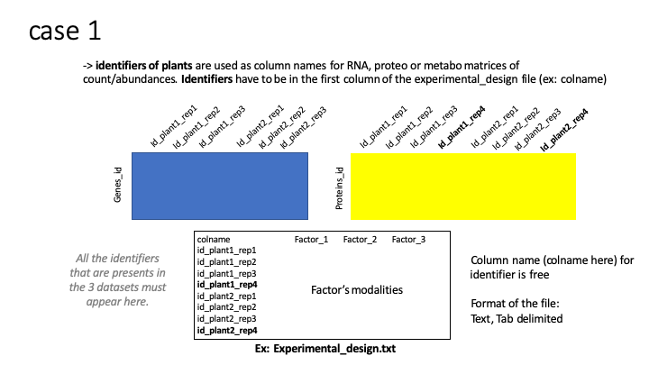

```{r, include = FALSE}
knitr::opts_chunk$set(
  collapse = TRUE,
  comment = "#>"
)

```

```{r}
library(RFLOMICS)
```


## Experimental design
<!-- ce fichier contient le plan experimental (conditions) plus des metadata par echantillons -->

This file provides the experimental design table. The first column indicates the sample names. Next columns indicate experimental conditions (called biological factor or replicate factor) and metadata (optional). Each row describes a sample by specifying the level for each experimental condition.
This file is edited by the user and must contain a header with explicit column names.
It is advised that each factor's modality starts with a letter (for example, for a factor called Month, it is better to write M1 rather than 1).

```{r ImportDesign, output="asis"}
# ExpDesign.file <- file.path(path=path.package("RFLOMICS"), 
#                             file="/ExamplesFiles/ecoseed/condition.txt")
ExpDesign.file <- file.path(paste0(system.file(package = "RFLOMICS"), "/ExamplesFiles/ecoseed/condition.txt"))
ExpDesign      <- read.table(file = ExpDesign.file, header = TRUE, row.names = 1, sep = "\t")

DT::datatable(ExpDesign)
```

## Omics data

For each omics : 
The first file **(mandatory)** provide matrix-likes of abundance of omics data : raw read counts per genes for RNAseq data, intensity of proteins for proteomics data, intensity of metabolites for metabolomics data. The first column indicates feature (gene, protein, metabolite) names and the other indicates sample names. 

### **RNAseq data**

<!-- les comptage de reads sont obtenu après une analyse bioinfo (mapping sur le genome de ref et comptage des reads qui couvrent chaque gene) -->

```{r RNAseq, output="asis"}

# geneCount.file <- file.path(path = path.package("RFLOMICS"), 
#                             file ="/ExamplesFiles/ecoseed/transcriptome_ecoseed.txt")
geneCount.file <- file.path(paste0(system.file(package = "RFLOMICS"),
                                   "/ExamplesFiles/ecoseed/transcriptome_ecoseed.txt"))
geneCount      <- read.table(file = geneCount.file, header = TRUE, row.names = 1, sep = "\t")

DT::datatable(geneCount[1:10, 1:5])
```


### **Proteomics data**

```{r Proteomics, output="asis"}
# protAbundance.file <- file.path(path = path.package("RFLOMICS"), 
#                                 file ="/ExamplesFiles/ecoseed/proteome_ecoseed.txt")
protAbundance.file <- file.path(paste0(system.file(package = "RFLOMICS"),
                                   "/ExamplesFiles/ecoseed/proteome_ecoseed.txt"))
protAbundance <- read.table(file = protAbundance.file, header = TRUE, row.names = 1, sep = "\t")

DT::datatable(protAbundance[1:10, 1:5])
```


### **Metabolomics data**

```{r Metabolomics, output="asis"}
# metaAbundance.file <- file.path(path = path.package("RFLOMICS"), 
#                                 file ="/ExamplesFiles/ecoseed/metabolome_ecoseed.txt")
metaAbundance.file <- file.path(paste0(system.file(package = "RFLOMICS"),
                                   "/ExamplesFiles/ecoseed/metabolome_ecoseed.txt"))
metaAbundance <- read.table(file = metaAbundance.file, header = TRUE, row.names = 1, sep = "\t")

DT::datatable(metaAbundance[1:10, 1:5])
```

## metadata

2) The second file **(optional)** provide supplementary information (metadata) for each sample (to develop).

```{r metadata, output="asis"}

# metadata.file <- file.path(path = path.package("RFLOMICS"), file ="/ExamplesFiles/ecoseed/???")
# metadata      <- read.table(file = metadata.file, header = TRUE, row.names = 1, sep = "\t")
# 
# DT::datatable(metadata[1:10, 1:5])

```




## Annotation

* **Load** annotation file(s) for enrichment analysis.

The column 1 => feature names (same used in abundance matrix)
The column 2 => term IDs (ex. GO term accession : GO:0034599)
The column 3 => term names (ex. GO term name : cellular response to oxidative stress)
The column 4 => source or type (ex. GO domain : biological_process)

```{r, output="asis"}

# annot.genes.file <- file.path(path=path.package("RFLOMICS"), file="/ExamplesFiles/ecoseed/AT_GOterm_EnsemblPlants.txt")
annot.genes.file <- file.path(paste0(system.file(package = "RFLOMICS"),
                                   "/ExamplesFiles/ecoseed/AT_GOterm_EnsemblPlants.txt"))
annot.genes <- read.table(file = annot.genes.file, header = TRUE, sep="\t", )
colnames(annot.genes) <- c("geneID", "Term", "Name", "Domain")

DT::datatable(annot.genes[1:10,])
```


