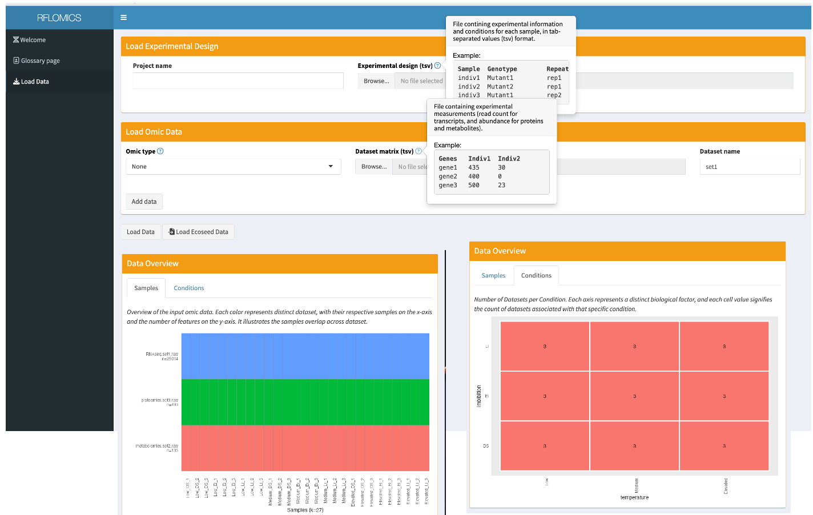
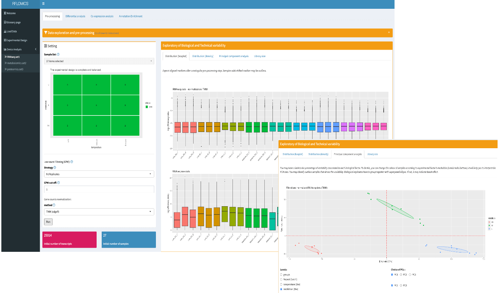
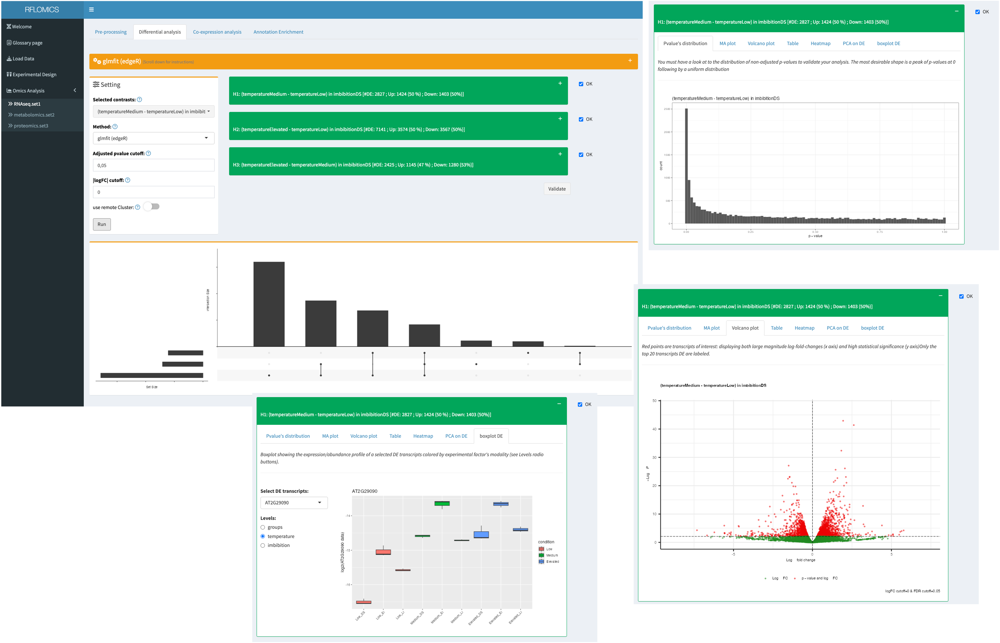
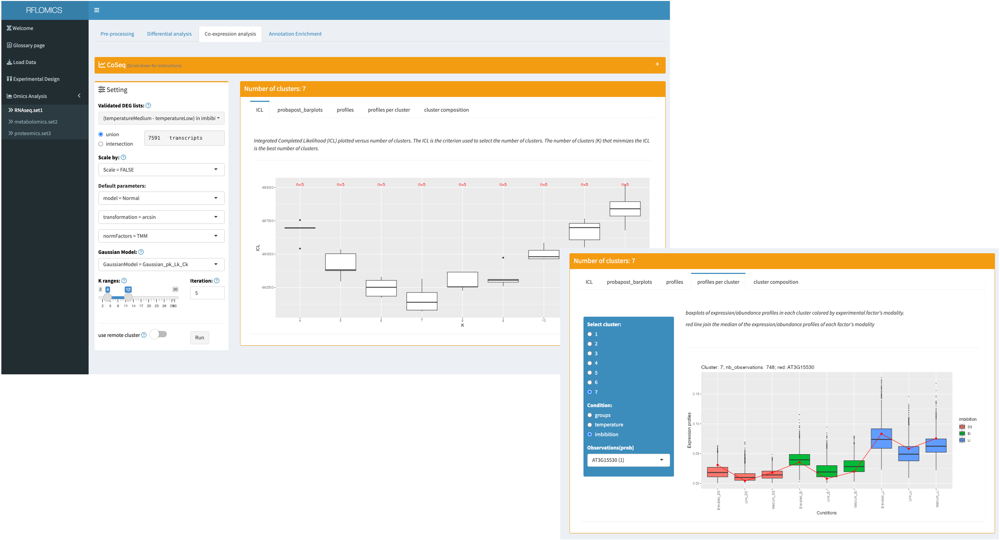
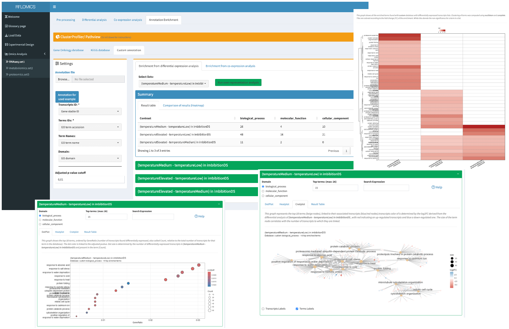
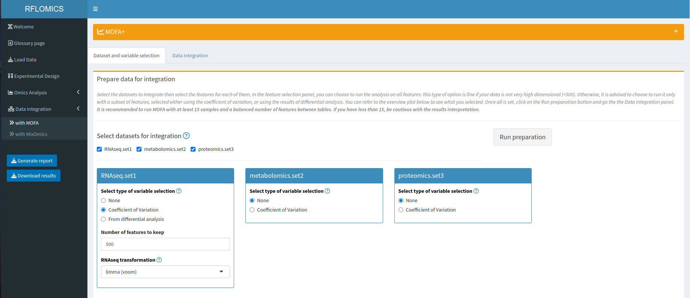
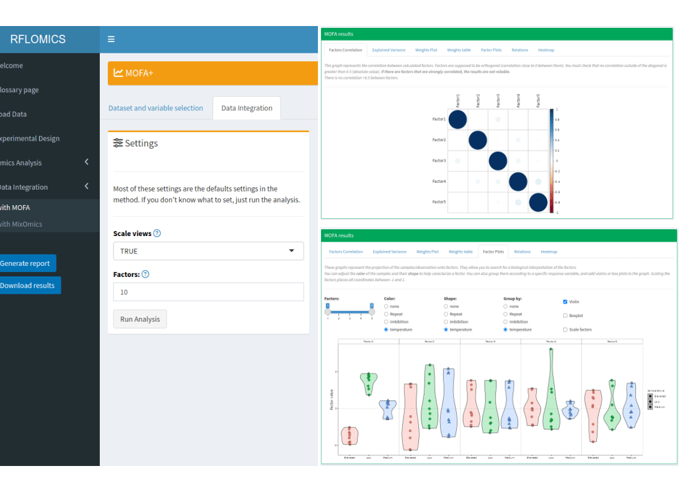
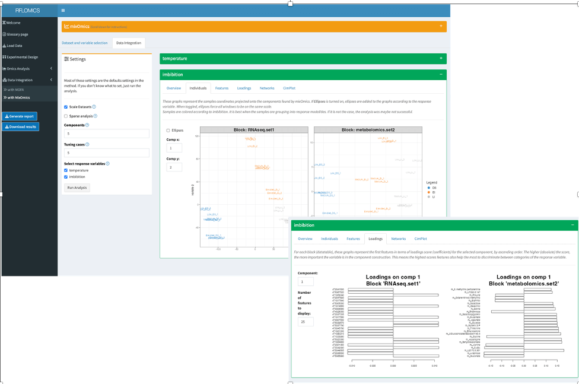

 

```{r, include = FALSE}
knitr::opts_chunk$set(
  collapse = TRUE,
  comment = "#>"
)
```

# Run RFLOMICS

```{r, eval=FALSE}
library(RFLOMICS)
runRFLOMICS()
```

This vignette will follow the different steps of multi-omics analysis trough the 
RFLOMICS interface which are: 

- Data loading
- Statistical framework setting
- Single omics analysis of each dataset 
- Single omics results summary
- Multi-omics analysis (with the constraint of at least 2 pre-processed 
datasets)

They will appear in the left tab menu of the interface along with the analysis 
progression. Whereas single omics analysis steps will be displayed in tab panel 
associated to each dataset .

# Load Data

Data loading start by setting a project name (it is mandatory), then load the 
experimental design and finally the different omics datasets.

## Dataset example description:

Data used for this vignette have been provided by Pr. Loic Rajjou and Gwendal 
Cueff. It is included in the 'ExamplesFiles' directory of the package.
Briefly, A. thaliana's transcriptome, metabolome and proteome have been obtained 
in the context of the study of seed germination and vigor. In particular, the 
authors were interested in deciphering key entities involved in response to 
environmental stresses (on the mother plant): influences of temperature 
(high, medium and low) and imbibition stage (Dry: DI, early imbibition: 
EI and late imbibition: LI). See(https://www.uibk.ac.at/botany/ecoseed/home/) 


## Load Experimental Design

The experimental design file must contain experimental information/conditions 
for each sample in a tab separated values format (see RFLOMICS-input-data.html).
As soon as this file is loaded, for each design factor, we have to set up the 
factor type (Biological factor: Bio; batch factor: batch; 
metadata information: meta) and a reference level.

* *It is required to have a minimum of 1 biological factor (maximum 3) and 1 batch factor. Order of the columns does not matter.*

* *It is possible to remove factor's conditions from the design. Associated samples will be excluded from the analysis even if they are present in the omics dataset matrix.*

* *It is also possible to re-order factor modalities* 

## Load Omics data

  Experimental data must be loaded as matrix files in a tab separated values format.
  (for more information see RFLOMICS-input-data.html).
  For each dataset it is mandatory to specify the type of omics (transcriptomics, 
  proteomics, metabolomics ) as it will adapt the data processing and analysis 
  methods. By default, datasets will be called set1, set2, set3, ..., respectively.
  A more suitable name can be given by changing 'Dataset name' in the interface.
 
 To load the 3 examples datasets of the Ecoseed project: RNAseq data (read counts), 
 proteomics data (abundance of proteins), and metabolomics data (intensity of metabolites) 
 (see RFLOMICS-input-data.html), please press the 'Load Ecoseed Data'.
 

As soon as the data are loaded the **RFlomics MultiAssayExperiment** object is 
created. The data overview panel displays the samples overlap across datasets 
and the number of datasets per combination of biological factors.

{width=80%}

# Set the statistical framework

 The interface provides models written from the simplest one to the most complete
 one. Only the second order interaction terms between the biological factors appear. 
 Batch factors never appear in interaction terms. In our example, the complete model 
 is chosen.

All 'a priori' hypotheses (contrasts) are then calculated from the chosen model 
and displayed. The user must select those that correspond to the biological questions.
Contrasts are numbered. These labels will follow for all analysis.

In our example we are studying the effect of temperature on seed germination 
(transition from the state of dormancy to the state of germination vigor). 
For that we select 3 average contrasts (see image):

This statistical framework will be applied on all loaded datasets.  

{width=80%}

# Single omics data analysis

Once the contrasts are chosen, 3 Item menus appear in the side bar menu that 
correspond to the 3 loaded omics types.

For each dataset, different steps of data analysis are proposed as a tab panel. 
These analysis steps must be performed sequentially. It is possible to switch 
between datasets.
However, you cannot perform a new task until the previous one is completed. 
A progress bar is displayed indicating the progress status.

## Data processing and quality check

In this tab panel we access a data quality control screen and we perform the 
appropriate data filtering and processing according to the type of omics.

By default, features with 0 count in all conditions are removed from the data.

Specifically for each data we have the possibility to exclude samples or to 
select a subset of samples to analyze, provided the completeness condition is met. 

### Completeness check

 The design must be complete and as possible balanced. A **Complete design (mandatory)** 
 mean that all possible combinations of biological factors' levels (called groups) 
 are presents. A **Balanced design (recommended)** has an equal number of o
 bservations (replicates) for each group.

These constraints are checked and represented as graph (each square represent 1 
group and each color level indicate the number of observations). 

```{r, fig.show="hold", out.width="40%", fig.align = "center", echo=FALSE}
knitr::include_graphics(c("Images/00_completeDesign.png","Images/00_nonBalancedDesign.png"))
```

The effect of data filtering or sample removing step can be explored thanks to 
many QC graphs. For each QC, a graph is built on each raw data and filtered data 
to allow the comparison.


###  Transcriptomics data

For RNAseq data, low expressed genes are filtered so that only genes whose cpm 
expression is greater than **"CPM cutoff"** in x samples are kept. The value of 
x is given by **"Filtering strategy"** (NbOfsample_over_cpm <= NbConditions). 
By default the data are filtered based on NbCondition strategy with CPM cutoff 
equal to 5. In this example, there are 9 conditions. So, the number of genes 
with a CPM less than 5 in at least 9 samples are removed.

```{r}
# geneToKeep <- counts[rowSums(edgeR::cpm(counts) >= CPM_Cutoff) >= x, ]
```

To correct for differences in sequencing depths (library size), Rflomics proposes
one method for normalization, **"TMM method"** from edgeR package.

```{r}
# dge <- edgeR::DGEList(counts=counts, group=groups)
# dge <- edgeR::calcNormFactors(dge, method="TMM")
```

For RNAseq data the QC graphs are drawn before and after the filtering and 
normalization steps. The following graphs are displayed:

- The log2(count) distribution per sample: Expect aligned medians. Samples with 
shifted median may be outliers.
- The library size distribution which is the distribution of the total number of 
reads per sample.
- The density distribution of log2(count) per sample: Expect a unimodal gaussian 
density distribution.
- An interactive Principal Component Analysis allowing to color samples by any 
factor of the design to decode the main sources of variation in the data.

{width=80%}


## Differential expression analysis

In this tab panel, we can run the differential expression analysis. The analysis
is run by contrast.  
For RNAseq data, the **glmFit()** function from the **edgeR** package is used 
whereas for proteomic and metabolomic data, the **lmFit()** function from **limma**
packages is used. The ability to run analysis on a cluster is offered by sliding 
the cluster button (see RFLOMICS-configure-cluster-access vignette)


Results will appear in two components: a scrolling menu will give the results of 
the analysis by contrat and, at the bottom of the panel, the intersecting sets of 
the lists of DEG is given thanks to the **UpSetR()** function.  

Each results has to be validated:

- You **have to** to check the Pvalue distribution for each contrast and validate 
it (**ok checkbox**). 
  + If the distribution is uniform: it is ok. A few genes are DE and the FDR will
  find them.
  + If the distribution as a peak near 0 and then is uniform: it is also ok. The
  higher the peak, the higher the number of DE genes. FDR correction can be applied.
  + If the distribution has 2 peaks one near 0 and one near 1 or just one peak near 1, 
  it is not a good news! You have to understand what's happened.

- You can filter differentially expressed genes/proteins/metabolites either by 
fold change (**|FC|**) or by False Discovery Rate (BH) cut-off. Graphs will be 
automatically updated.

- You have to **validate** to save the cut-off thresholds but also the contrasts
result selection  and pass to the co-expression analysis or to the annotation 
enrichment step.
 
{width=80%}
 
## Coexpression analysis

* In this tab panel, choice is given to merge (**union**) or intersect  
(**intersection**) the lists of differentially expressed genes/proteins/metabolites 
associated to contrasts.

* Co-expression analysis is done using to the **coseq** package with a set of 
optimal parameters.

  - For **RNAseq**, data transformation method is set to the **arcsin** function 
  and normalization method to **TMM**. No scaling is done for these data. 
  **gaussian mixture model** is used to decipher the different profiles of gene 
  expression with a set of parameters to estimate fixed to (Gaussian_pK_Lk_Ck).
  - For **proteomics/metabolomics** data, scaling is done on proteins/metabolites.
  Another sets of parameters estimation is also proposed for the modeling of gene 
  expression profile: (Gaussian_pK_Lk_Bk). It has to be used, if the other one 
  doesn't fit.


The number of technical replicates to perform (**iter**) for each **K** which is 
the number of expressions' profile into which
the DEG have to be cut, can be first set to 2 to precise the range of K and then 
put to a minimum of 20 replicates per K.

The ability to run the clustering analysis on a cluster is offered by sliding 
the Cluster button (see Rflomics_configure-cluster-access).


* Results description (see [CoSeq](https://www.bioconductor.org/packages/release/bioc/vignettes/coseq/inst/doc/coseq.html))

  - Results can be explored with several plots proposed by **coseq**. 
  The ICL graph has been slightly modified to show all the range of the ICL 
  values for a given K. 
   
  - A table of jobs summary is also given. It groups error messages by K.  

{width=80%}

## Annotation and Enrichment analysis using clusterProfilR

 We select the lists of DE genes or clusters to annotate. All available lists 
 are selected by default. 

 The enrichment analysis is performed using the [clusterProfiler R-package](https://www.sciencedirect.com/science/article/pii/S2666675821000667).
 For more information on the methods and the package, please see 
 [The article](https://www.sciencedirect.com/science/article/pii/S2666675821000667), 
 [Bioconductor Package](https://bioconductor.org/packages/release/bioc/html/clusterProfiler.html) 
 and the [clusterProfiler Vignette](https://yulab-smu.top/biomedical-knowledge-mining-book/). 

You can chose between several domains, depending on several parameters: 

* custom: preferred option. It requires an annotation file (tabulated, at least 
two columns, one for the name of the gene, the other for the name or id of the 
annotation term). A second panel will allow the user to indicate which columns 
indicates what. You can have as many domains/ontology as you want, you just need 
to indicate the columns name that differentiate them in the right area;
* GO (or GO:BP, GO:CC, GO:MF if only one GO domain is of interest). The user will 
have to chose a database library ([org.*.db](https://www.bioconductor.org/packages/release/BiocViews.html#___OrgDb)) 
installed on the libPath and the keytype of the entities (identifier to make the 
connection with the annotation). 
* KEGG: In the setting panel, enter the three letters to identify the organism 
and the keytype of the entities. It requires to have an online connection. 

Once everything is set and the analysis is conducted, several panels are displayed 
to show the results. 

{width=80%}

## Dataset analysis summary 

 This panel summarizes the effects of the filtering steps on the selected datasets
 and the results of the differential analyses. The first row shows how many 
 samples and entities are left in each table. The integration will be performed 
 on these datasets. The second row shows the number of DE entities for each 
 selected contrast and for each table, with the distinction between up-regulated 
 and down-regulated entities.  


# Integration

 Once at least two tables have passed the pre-processing step, the Integration 
 tab will appear in the side bar menu. Two sub menus are available. For each of 
 them, you will have to run a preprocessing before accessing to the integration 
 panel: select the datasets you want to integrate together and the filtering 
 strategy for each data. A filtering is strongly advised when having large data 
 or unbalanced number of features between them with the goals to homogenize the 
 number of features between the datasets.
 
 You can filter according to the DE entities found in the differential analysis, 
 or based on the variation coefficient, taking a certain number of variables 
 that have the largest coefficient. For this example, we chose to keep only 500
 features from the RNAseq data, based on the variation coefficient.
 
 RNAseq data will be transformed before the integration. This is done with the 
 **voom** transformation from the **limma** R package.   

 Batch effects are removed before applying the function, using 
 **removebatcheffect** from **limma**.
 
 Features are then centered before the integration.

{width=100%}

## MOFA

 This integration analysis is performed using the **MOFA2** R-package. It is an 
 unsupervised method that searches for latent factors to decompose the variance 
 of the data, similarly to a PCA, but applied to a multi-dataset situation. The 
 interpretation of the results is also very similar to those of a PCA: the most
 interesting factors are the one explaining more variance, whether it's on 
 several dataset or just one table. It also gives weights to the features of 
 each table, for each factor. This is interesting in case a factor can be 
 **a posteriori** linked to a covariate (in the case displayed on the figure, 
 the temperature seems linked to the first factor, the features used to build
 this factor are to be considered very relevant in the analysis).  

{width=80%}

 The user can chose to scale or not each tables, with the scale views argument,
 then set the number of factors to be computed and finally the maximum 
 iterations for the MOFA run. We recommend that the user do not change the 
 number of iterations.  Once everything is set, you can run the analysis by 
 clicking on the run button. 
 
Several figure are provided by the interface once the analysis is done.

## MixOmics

 This integration analysis is performed using the **MixOmics** R-package. 
 In RFLOMICS, we focused on the supervised analyses using the functions 
 block.(s)plda (also called DIABLO) from the package. Only complete cases 
 will be used for the analysis. The user can select all biological factors 
 as response variables. The meta and  batch factors are not available.

 Using Sparse Analysis will set the "s" in the function names. It this case, 
 the tuning 'cases' argument will be considered and passed to tune.splsda or 
 tune.block.splsda: it determines the number of features selection to be tested. 

 In RFLOMICS, we chose to only ask for a number of cases. This number of cases 
 is used to determine the keep.X argument, using a span of nfeatures/number of 
 cases. By example, if the user chose 5 cases and has 2 datasets with 
 respectively 500 and 250 features, the function will test 25 combinaisons of 
 features per component. For each datasets, features will be picked-up in a 
 cumulative manner ie for the DS1: 100,200,300,400,500 and 
 DS2: 50, 100, 150, 200, 250. An example of combination will be 
 c(DS1=100,DS2=50). The best combination of results by components will be used 
 by mixOmics block.splsda.

 Once everything is set, you can run the analysis by clicking on the run button. 
Several figures are provided by the interface once the analysis is done, for 
each selected response variable.  

{width=100%} 


